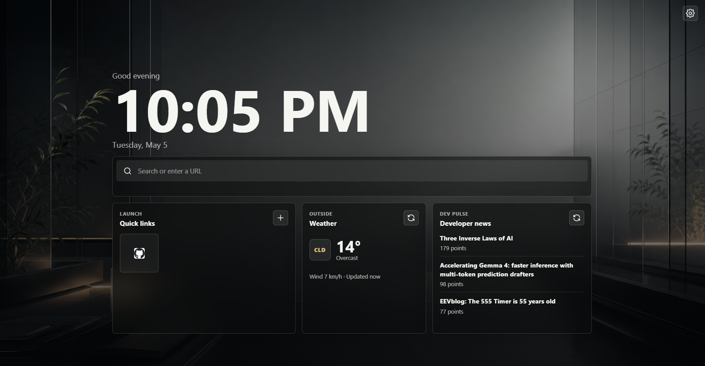

# Minimal Homepage

A sleek, minimal Chrome new-tab extension with wallpaper themes, icon quick links, live time, saved local weather, developer news, and a settings panel.

## Features

- Icon-only quick links with editable websites
- Search using the browser's default search engine
- Local weather with saved preference and cached display
- Minimal wallpaper themes controlled from settings
- Developer news feed
- Responsive layout for desktop and mobile

## Load in Chrome

1. Open `chrome://extensions`.
2. Enable `Developer mode`.
3. Choose `Load unpacked`.
4. Select this project folder.

The extension overrides Chrome's new tab page.

## License

MIT
